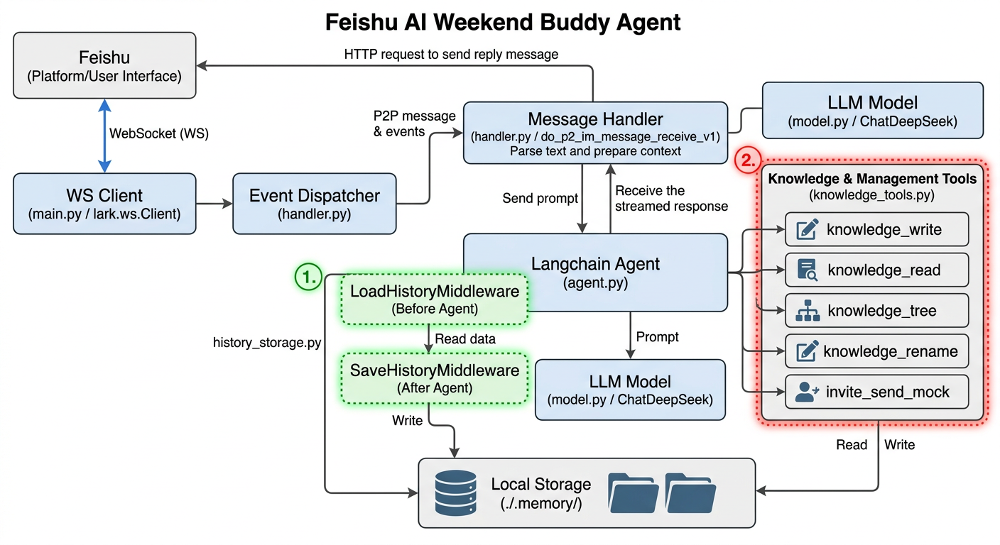

# Problem & MVP Scope
- 

- Problem: Weekend social planning has high friction—vague intent, scattered preferences, and coordinations. Users need help turning “I want to do something this weekend” into concrete options and a ready‑to‑send invite without leaving Feishu.
- Goal: Reduce coordination cost by staying entirely inside Feishu chat, extracting intent, recommending activities with rationale, and drafting an invite the user can send immediately.
- Scope MVP:
  - Feishu bot integration (receive messages; reply with text or simple cards).
  - **Central file-based memory system**: Every historical interaction, preference, and learned insight is persisted under `/memory/{open_id}/` as durable JSON files.  
  - Atomic knowledge tools: `create_knowledge`, `read_knowledge`, `rename_knowledge` give the agent full CRUD control so it can store, retrieve, and evolve every data point required to generate context-aware responses—no external DB, no lost history.
  - Draft invite messages and optionally send in the current chat.

# How AI/LLMs Were Utilized
- Intent understanding: System prompt to capture user intent and extract constraints, for Planning & recommendations.
- Tool use:
  - Read/write per‑user knowledge files under /memory/{open_id}/ to recall preferences.
  - Create/rename/read knowledge items to evolve long‑term memory.
  - Draft invite messages and mock send them to the user.
- Memory/Retrieval: Lightweight file‑based memory conditions prompts so the agent can remember past choices and adapt recommendations over time.
- Middlewares: Save and retrieve the conversation history as a long-term memory.
- Reasoning:
  - Reasoning mode enabled for better coherence and justification.

# Building Note

## Sign up Feishu: Done
- Status: Done

## Create Feishu Bot: 
- Status:Done
- URL: https://open.feishu.cn/app/cli_a953bd3b98399bd4/bot

## Project Setups
- How to setup bot to receive and send message:
添加“接收消息”事件（前往“事件与回调”面板 > 添加事件 > 消息与群组）后，机器人便可接收用户发送的单聊消息。
获取用户在群组中@机器人的消息：开通该权限，并添加“接收消息”事件（前往“事件与回调”面板 > 添加事件 > 消息与群组）后，可接收用户在群聊中@机器人的消息。
- Steps:
    - 前往“事件与回调”面板 > 事件配置 -> 仅需使用 官方 SDK 启动长连接飞书客户端: https://open.feishu.cn/document/uAjLw4CM/ukTMukTMukTM/event-subscription-guide/long-connection-mode#1c227849: Completed
    - Test Receiving the message
    - Test Sending Message
- Status: Done
- Setup Langchain Skill:Done
- Build a simple agent to response
- Testing Feishu Integration with the agent
- Solve the issue of duplicated message received

## Core Interaction Implementation
### Requirements: 
- Capture Intent: Understand preferences (activity, availability, location, budget, group vibe).
- Execute Logic: Suggest activities, explain the "why" behind recommendations, and propose
suit buddy types.
- Drive Action: Draft invite messages or coordination cards to move the user toward a firm
confirmation.

### Optional Requirements:
- Advanced agent reasoning/planning.
- Multi-step coordination or memory/preference learning.
- Unique agent-tool usage or new interaction patterns.

### Solutions:
- File-based knowledge manage tools to capture intent
- prompt in the system prompt to drive the agent to execute the logic.
- Tool to draft invite message and mock the invite sending
- Turned on the reasoning mode
- File-based knowledge manage tools for memory/preference learning.
- Unique tools to create knowledge, rename knowledge, read knowledge to empower the agent to learn from the user's interaction.

### How I spend development time:
- 20% — Project setup
    - Feishu app/bot creation, permissions, event subscription (long connection)
    - Local env setup (uv/.venv), required env vars, basic run command
    - Minimal logging + sanity checks for receiving/sending messages
- 10 % -_ Design Solution
- 20% — Agent core
    - Message ingestion, Feishu API docs understanding
    - Tooling + memory: write/read message history and long-term knowledge under /memory/{open_id}/
- 50% — Refactor, Testing & Debugging & Refinement and solve bugs 
    - Testing the all the tools, middlewares, 
    - Run scenario tests from TEST_MESSAGES.md end-to-end in Feishu chats
    - Validate tool behaviors (create/read/rename knowledge), error handling, solving the bugs.
